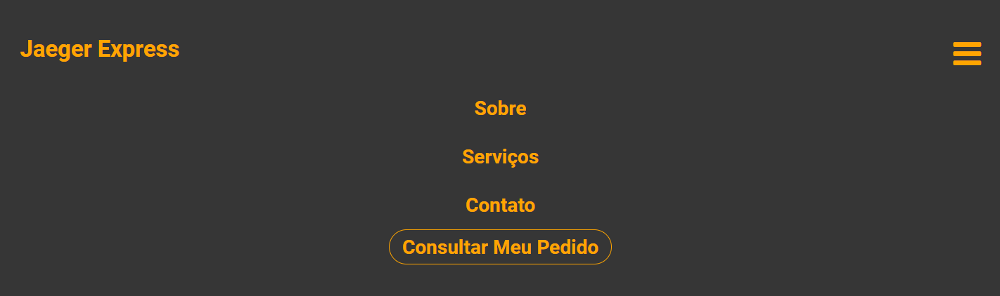
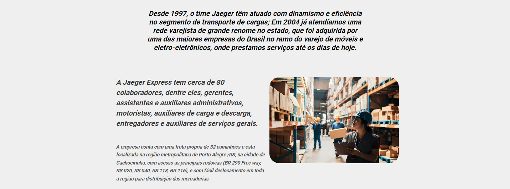
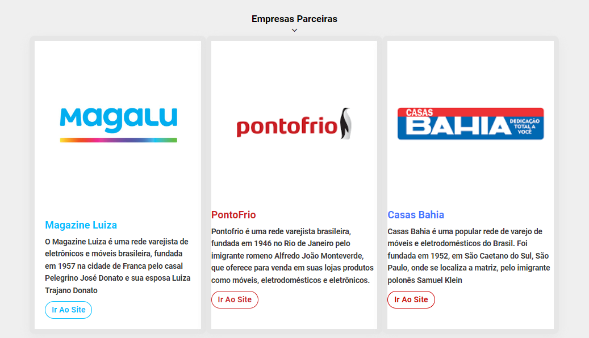

# About Page Transport

<H3> 
About Page Transport foi um desenvolvimento para aplicações de ferramentas programaticas como JQuery.<H3>
<H4> A empresa em destaque existe na vida real e tinha a possibilidade de mostrar a localização de seus fretes para seus clientes finais.<H4>

## Tecnologias Utilizadas

## Explicação
<H3> Header e Nav <H3>
<H3> O inicio temos alguns headers que não são utilizados, e posteriormente a se fazer é a tela de consulta de pedidos e o botão de "Procurar Pedido" que no final levaria para o mesmo lugar.<H3>

<H4> Uma funcionalidade importante desse header, é a de que quando a tela diminui a um determinado tamanho, o nosso side-bar muda de cor e organiza os headers em listas, essa funcionalidade foi feita com as animações prontas do JQuery.<H4>
<H5> Obs: isso acontecendo em telas mobile e desktop.<H5>

<H3> Section <H3>
<H3> Temos aqui algumas informações da transportadora, usando algumas tecnicas de css para deixar o layout mais profissional.<H3>

<H3> A parte final existe uma vitrine de empresas parceiras que usam essa transportadora como meio de transporte.

Utilizamos um botão para (ir ao site) da mesma e conhece-lá. <H3>
